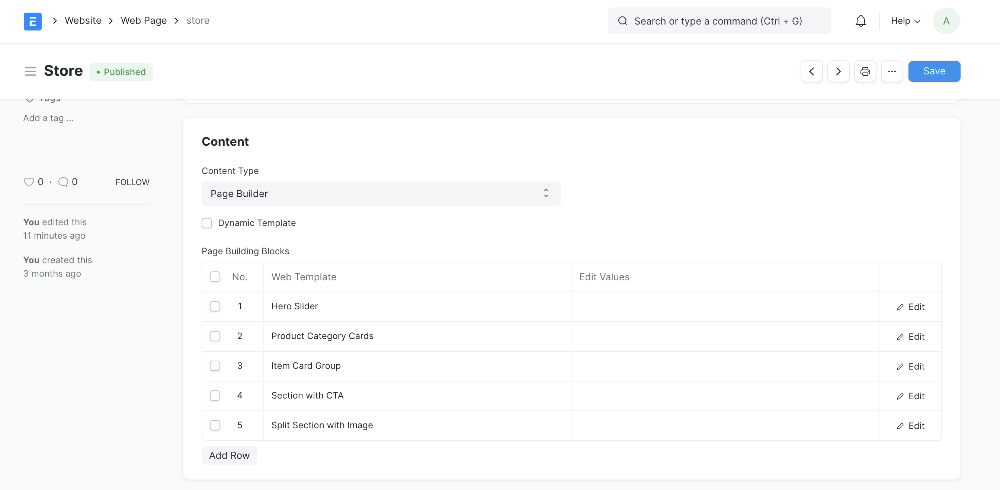

## Frappe Webshop



## Installation
1. [Install bench](https://github.com/frappe/bench).
2. [Install ERPNext](https://github.com/frappe/bench#installation).
3. Once ERPNext is installed, add the webshop app to your bench by running

    ```sh
    $ bench get-app webshop
    ```
4. After that, you can install the webshop app on the required site by running
    ```sh
    $ bench --site sitename install-app webshop
    ```

#### License
GNU GPL V3. (See [LICENSE](LICENSE) for more information).
